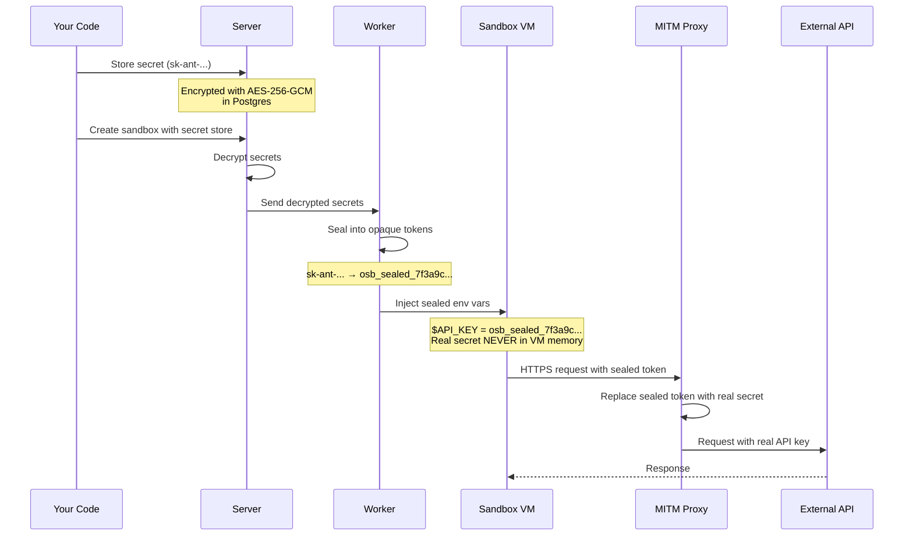

Secrets let you pass API keys, tokens, and credentials into sandboxes without the real values ever entering the VM. They are encrypted at rest, sealed into opaque tokens at boot, and only revealed by a host-side proxy on outbound HTTPS requests.

## How it works



<Info>
The real secret value only exists in the host-side proxy's memory — it is never written to disk, never sent to the VM, and never visible via `env` or `/proc` inside the sandbox.
</Info>

## Quick start

Create a secret store, add a secret, and launch a sandbox that uses it:

<CodeGroup>

```typescript TypeScript
import { Sandbox, SecretStore } from '@opencomputer/sdk';

// 1. Create a secret store with egress restrictions
const store = await SecretStore.create({
  name: 'my-agent-secrets',
  egressAllowlist: ['api.anthropic.com'],
});

// 2. Add an encrypted secret
await SecretStore.setSecret(store.id, 'ANTHROPIC_API_KEY', 'sk-ant-...');

// 3. Create a sandbox — secrets are injected as sealed tokens
const sandbox = await Sandbox.create({
  secretStore: 'my-agent-secrets',
  timeout: 600,
});

// Inside the VM, the env var is sealed — not the real key
const result = await sandbox.exec.run('echo $ANTHROPIC_API_KEY');
console.log(result.stdout); // "osb_sealed_7f3a9c..."

// But HTTPS requests to allowed hosts get the real value via the proxy
const apiResult = await sandbox.exec.run(`
  curl -s https://api.anthropic.com/v1/messages \\
    -H "x-api-key: $ANTHROPIC_API_KEY" \\
    -H "anthropic-version: 2023-06-01" \\
    -H "content-type: application/json" \\
    -d '{"model":"claude-haiku-4-5-20251001","max_tokens":10,"messages":[{"role":"user","content":"hi"}]}'
`);
console.log(apiResult.stdout); // 200 OK — real key was substituted by the proxy
```

```python Python
from opencomputer import Sandbox, SecretStore

# 1. Create a secret store with egress restrictions
store = await SecretStore.create(
    name='my-agent-secrets',
    egress_allowlist=['api.anthropic.com'],
)

# 2. Add an encrypted secret
await SecretStore.set_secret(store['id'], 'ANTHROPIC_API_KEY', 'sk-ant-...')

# 3. Create a sandbox — secrets are injected as sealed tokens
sandbox = await Sandbox.create(
    secret_store='my-agent-secrets',
    timeout=600,
)

# Inside the VM, the env var is sealed — not the real key
result = await sandbox.exec.run('echo $ANTHROPIC_API_KEY')
print(result.stdout)  # "osb_sealed_7f3a9c..."

# But HTTPS requests to allowed hosts get the real value via the proxy
api_result = await sandbox.exec.run(
    'curl -s https://api.anthropic.com/v1/messages '
    '-H "x-api-key: $ANTHROPIC_API_KEY" '
    '-H "anthropic-version: 2023-06-01" '
    '-H "content-type: application/json" '
    '-d \'{"model":"claude-haiku-4-5-20251001","max_tokens":10,"messages":[{"role":"user","content":"hi"}]}\''
)
print(api_result.stdout)  # 200 OK — real key was substituted by the proxy
```

</CodeGroup>

## Per-secret host restrictions

You can restrict individual secrets so they are only substituted in requests to specific hosts. This prevents a compromised dependency from exfiltrating secrets to an attacker-controlled server.

<CodeGroup>

```typescript TypeScript
// This secret will only be substituted in requests to api.anthropic.com
await SecretStore.setSecret(store.id, 'ANTHROPIC_API_KEY', 'sk-ant-...', {
  allowedHosts: ['api.anthropic.com'],
});

// This secret works on any allowed egress host
await SecretStore.setSecret(store.id, 'GENERIC_TOKEN', 'tok-...');
```

```python Python
# This secret will only be substituted in requests to api.anthropic.com
await SecretStore.set_secret(
    store['id'], 'ANTHROPIC_API_KEY', 'sk-ant-...',
    allowed_hosts=['api.anthropic.com'],
)

# This secret works on any allowed egress host
await SecretStore.set_secret(store['id'], 'GENERIC_TOKEN', 'tok-...')
```

</CodeGroup>

## Egress allowlists

Secret stores can restrict which hosts the sandbox can make HTTPS requests to. Requests to hosts not on the list are blocked by the proxy.

<CodeGroup>

```typescript TypeScript
const store = await SecretStore.create({
  name: 'restricted-store',
  egressAllowlist: ['api.anthropic.com', '*.openai.com'],
});
```

```python Python
store = await SecretStore.create(
    name='restricted-store',
    egress_allowlist=['api.anthropic.com', '*.openai.com'],
)
```

</CodeGroup>

Supports exact matches (`api.anthropic.com`) and wildcards (`*.openai.com`). An empty allowlist means all hosts are allowed.

## Managing secrets

<CodeGroup>

```typescript TypeScript
// List all secret stores
const stores = await SecretStore.list();

// List secrets in a store (metadata only — values are never returned)
const entries = await SecretStore.listSecrets(store.id);

// Delete a secret
await SecretStore.deleteSecret(store.id, 'OLD_KEY');

// Delete a store and all its secrets
await SecretStore.delete(store.id);
```

```python Python
# List all secret stores
stores = await SecretStore.list()

# List secrets in a store (metadata only — values are never returned)
entries = await SecretStore.list_secrets(store['id'])

# Delete a secret
await SecretStore.delete_secret(store['id'], 'OLD_KEY')

# Delete a store and all its secrets
await SecretStore.delete(store['id'])
```

</CodeGroup>

## Secrets with snapshots and checkpoints

You can attach a secret store when creating a sandbox from a snapshot or checkpoint, even if the original didn't have one. This is useful for baking a base environment (e.g., installed dependencies) and then giving each fork its own scoped credentials.

<CodeGroup>

```typescript TypeScript
// Bake a base snapshot with git credentials
const base = await Sandbox.create({ secretStore: 'git-creds' });
await base.exec.run('git clone https://github.com/org/repo /app');
const cp = await base.createCheckpoint('repo-cloned');

// Fork with sandbox-specific API credentials
const worker1 = await Sandbox.createFromCheckpoint(cp.id, {
  secretStore: 'worker-1-keys',
});
const worker2 = await Sandbox.createFromCheckpoint(cp.id, {
  secretStore: 'worker-2-keys',
});
```

```python Python
# Bake a base snapshot with git credentials
base = await Sandbox.create(secret_store='git-creds')
await base.exec.run('git clone https://github.com/org/repo /app')
cp = await base.create_checkpoint('repo-cloned')

# Fork with sandbox-specific API credentials
worker1 = await Sandbox.create_from_checkpoint(cp['id'],
    secret_store='worker-1-keys',
)
worker2 = await Sandbox.create_from_checkpoint(cp['id'],
    secret_store='worker-2-keys',
)
```

</CodeGroup>

### Layering rules

When a checkpoint already has a secret store and you attach another at fork time, the stores are **merged**:

- **Secrets**: Both stores' secrets are available. On name collision, the fork's store wins.
- **Egress allowlists**: Aggregated (union of both stores' lists).
- **Per-secret host restrictions**: Follow the winning secret's store.

This means a base snapshot can provide broad credentials (e.g., git access) while each fork adds its own scoped credentials (e.g., limited API keys).

On a fork-of-fork, the checkpoint's merged result becomes the new base — there's no unbounded chain of stores to resolve.

## Security properties

| Property | Detail |
| --- | --- |
| **Encryption at rest** | AES-256-GCM in Postgres, key via `OPENSANDBOX_SECRET_ENCRYPTION_KEY` |
| **Never in VM memory** | Env vars contain opaque `osb_sealed_*` tokens |
| **Host-side only** | Real values exist only in the MITM proxy process on the worker host |
| **Egress control** | Allowlists restrict which domains receive secrets |
| **Per-secret scoping** | Individual secrets can be locked to specific hosts |
| **Values never returned** | The API only returns secret names and metadata, never values |

## Next steps

- [CLI reference](/cli/secrets) — manage secret stores and secrets from the command line
- [TypeScript SDK reference](/reference/typescript-sdk#secret-stores) — full API reference
- [Python SDK reference](/reference/python-sdk#secret-stores) — full API reference
